# Grocery Sort
Grocery Sort is a desktop application built with WPF and C# that helps users organize grocery lists based on customizable store layouts.
The application automatically sorts grocery items by category order, making shopping more efficient and structured.

The project was developed as a semester project and focuses on clean UI design, database integration, and practical everyday usability.

## Features

**Grocery Lists**
- Create multiple grocery lists
- Edit and delete existing lists
- Select an active grocery list
- Automatically save lists using SQLite

**Store Layouts**
- Create custom store layouts
- Define category order for each store
- Edit and delete layouts
- Prevent deletion of layouts currently in use

**Grocery Items**
- Add grocery items with:
    - Name
    - Category
    - Amount
- Edit and remove items
- Mark items as completed
- Checked items are visually highlighted

**Automatic Sorting**
- Grocery items are automatically sorted according to the selected store layout
- Categories appear in the same order as they would in a real store

**Favorites**
- Save recurring or favorite grocery items
- Quickly add favorites to lists

**Database Integration**
- SQLite database persistence
- Automatic loading and saving of:
    - Grocery lists
    - Store layouts
    - Grocery items
- Full CRUD functionality implemented

**User Interface**
- Modern card-based WPF interface
- Multi-window workflow
- Responsive layout using Grid and StackPanel
- Data binding with `ObservableCollection`
- Reactive UI updates using `INotifyPropertyChanged`

---

## Technologies Used
- C#
- WPF (.NET)
- XAML
- SQLite
- Microsoft.Data.Sqlite
- Git & GitHub

---

## Project Structure
Main windows and dialogs:
- `MainWindow`
    - Main application interface
- `CreateListWindow`
    - Create and edit grocery lists
- `AddItemWindow`
    - Add and edit grocery items
- `ManageLayoutsWindow`
    - View and manage store layouts
- `CreateLayoutWindow`
    - Create and edit layouts

Core classes:
- `GroceryItem`
- `GroceryList`
- `StoreLayout`
- `DatabaseHelper`

---

## Database
The application uses SQLite for local data storage.

Implemented database functionality includes:
- Table creation
- Saving data
- Loading data
- Updating existing entries
- Deleting entries
- Foreign key relationships
- Transaction handling

---

## Installation

### Requirements
- Windows
- .NET Desktop Runtime
- Visual Studio (recommended for development)

### Setup
1. Clone the repository:
```bash
git clone https://github.com/20252485/sem4_wpf_rauhofer.git
```
2. Open the solution in Visual Studio 
    - `Grocery_Sort.sln`
3. Restore NuGet packages 
    - (automatically handled by Visual Studio)
4. Run the project

---

## How to Use

### Creating a Store Layout
1. Open the layout manager
2. Create a new store layout
3. Add categories in the desired store order
4. Save the layout

### Creating a Grocery List
1. Create a new grocery list
2. Select a store layout
3. Add grocery items
4. Save the list

### Sorting Items
- Grocery items are automatically sorted based on the selected store layout

### Managing Items
- Add, edit, or remove grocery items
- Mark items as completed
- Save recurring items as favorites

---

## Screenshots

### Main Window
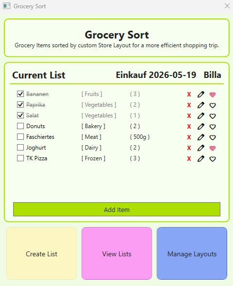

### Create Layout Window
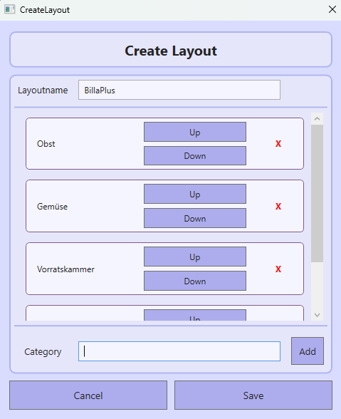

### Create List Window
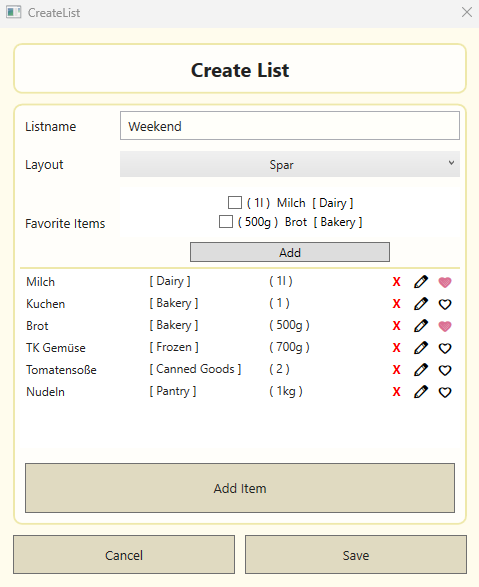

### Add Item Window
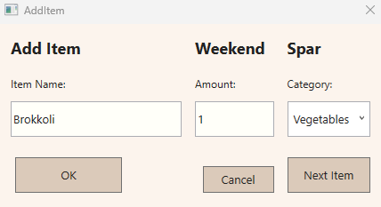

### Manage Layouts Window
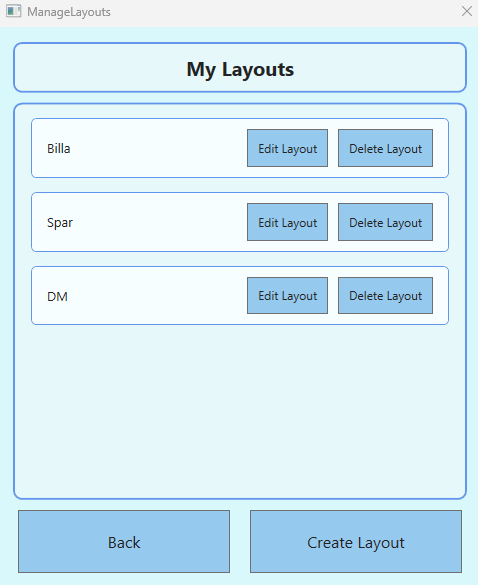

### View Lists Window
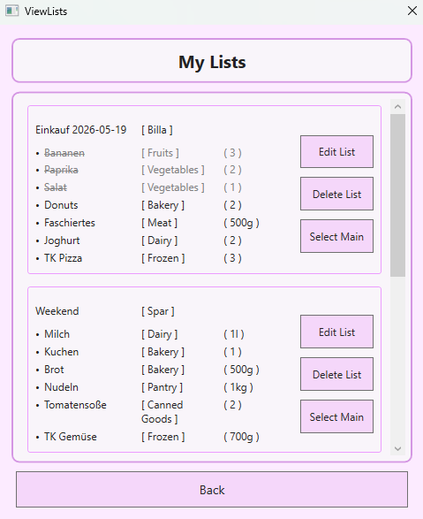

### Edit Layout
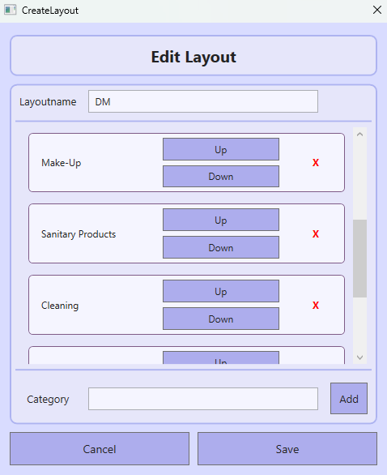

### Edit List
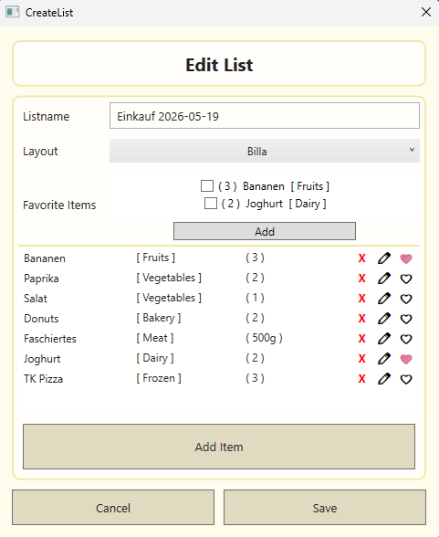

### Edit Item
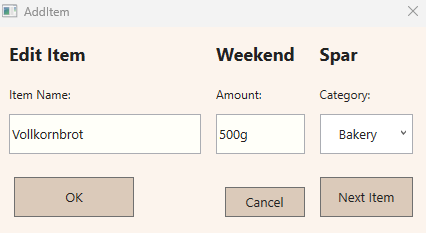

### Edit Category
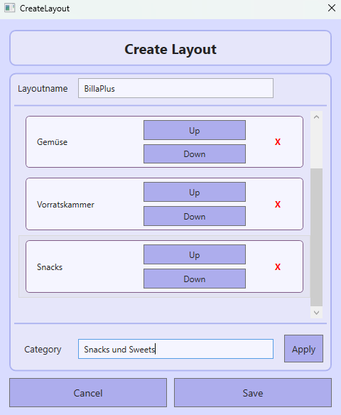

### Favorites
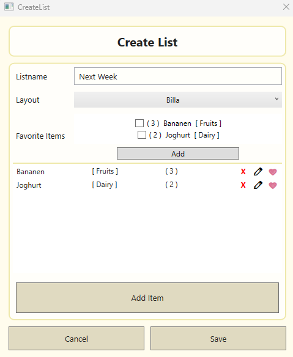

---

## License
This project is licensed under the MIT License.
See the LICENSE file for more information.

---

## Author
Created by Feuermelda

Semester project focused on WPF development, database integration, and UI design.